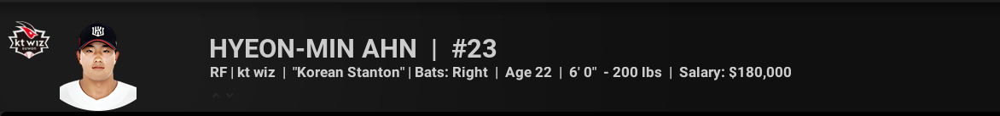
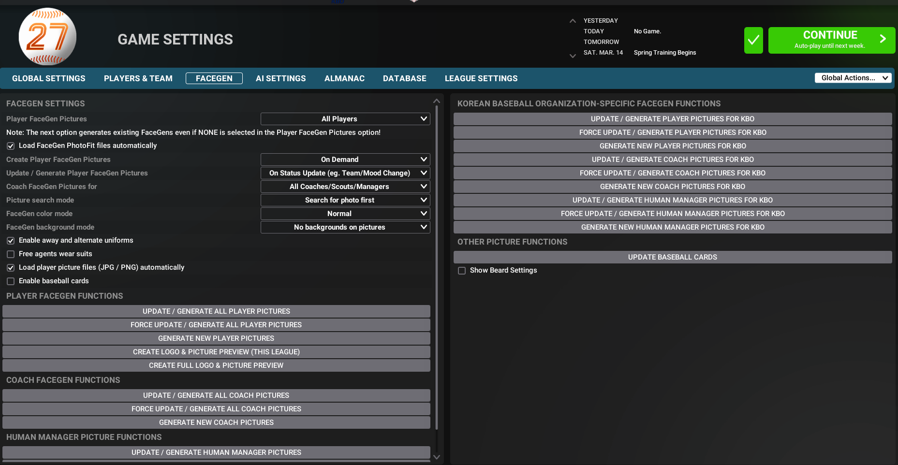

# OOTP 27 KBO Photopack

[한국어](./README.md) | **English**

KBO player portraits for OOTP 27, prepared in `bbrefminors_id` format.

## Install

1. Copy all PNG files from the `photos` folder into your OOTP 27 `data/photos` folder.
2. Overwrite existing files if prompted.
3. In game, go to `Settings -> FaceGen -> Picture Search Mode -> Search for photos first`.
4. Run `Update/Generate All Player Pictures`.

Example:

- Windows (Steam): `...\\Out of the Park Baseball 27\\data\\photos`

## Included

- 621 player portraits
- Image size: `90x135`
- Filename format: `bbrefminors_id`
